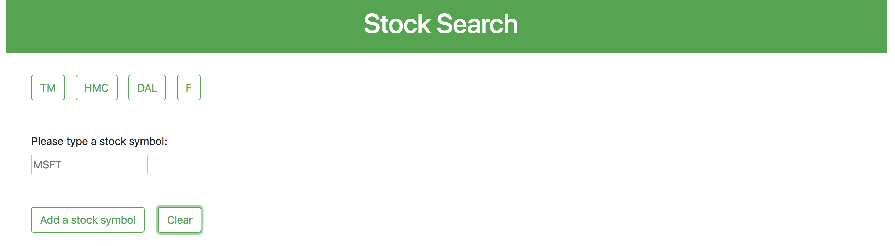
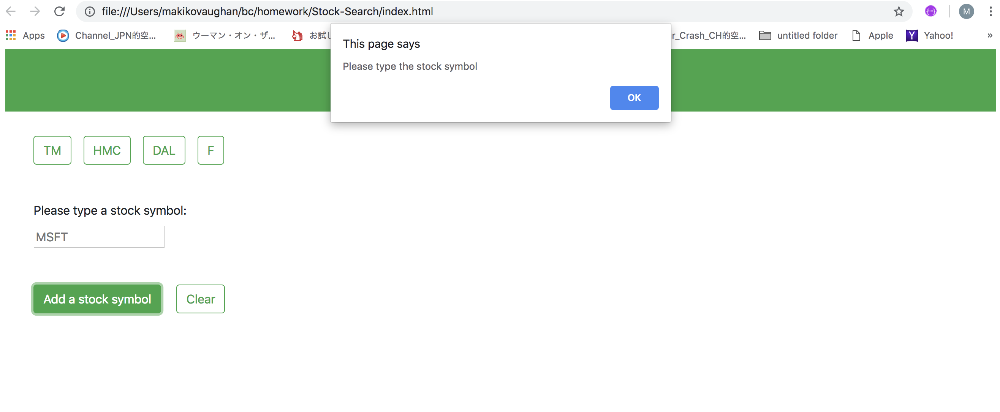
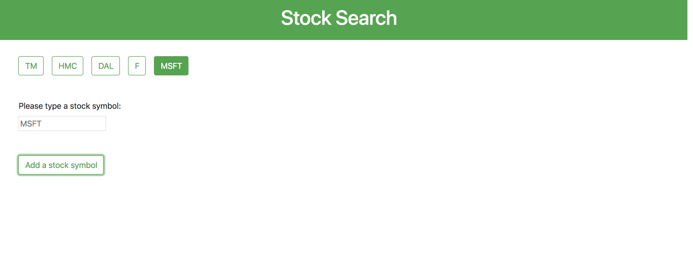
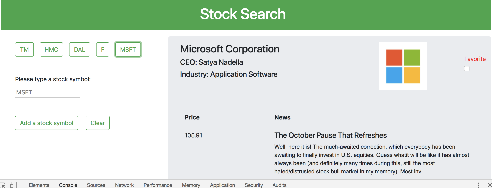
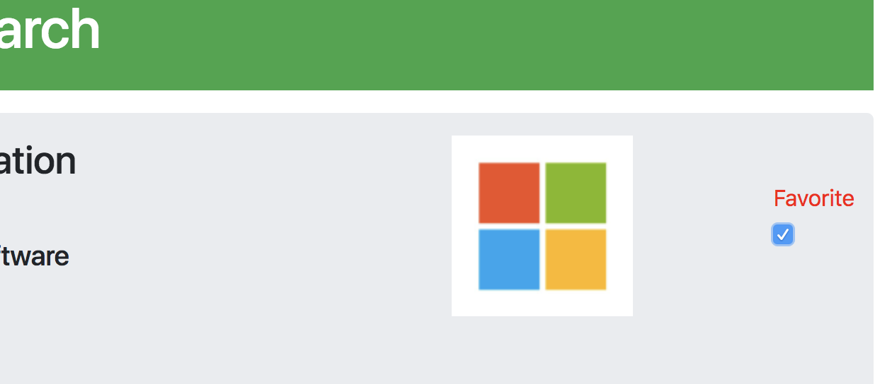
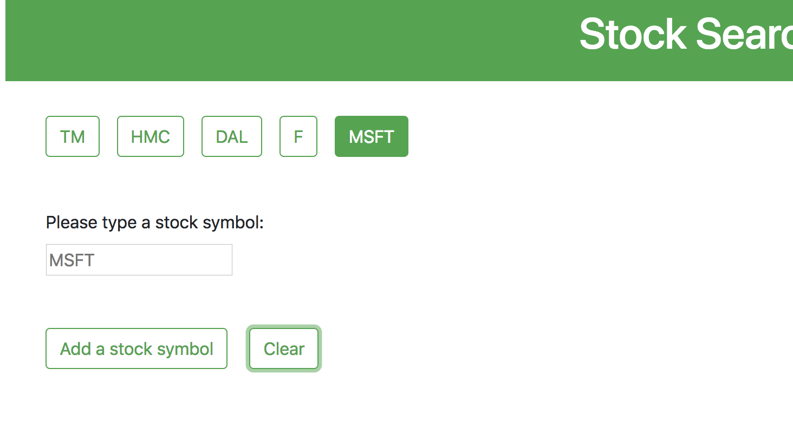
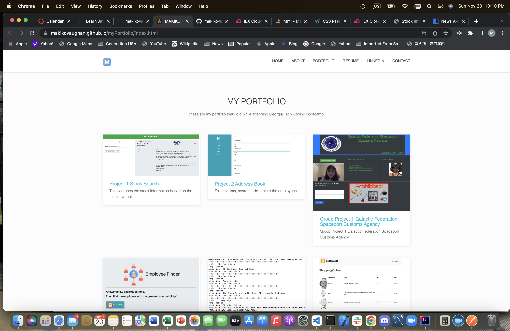
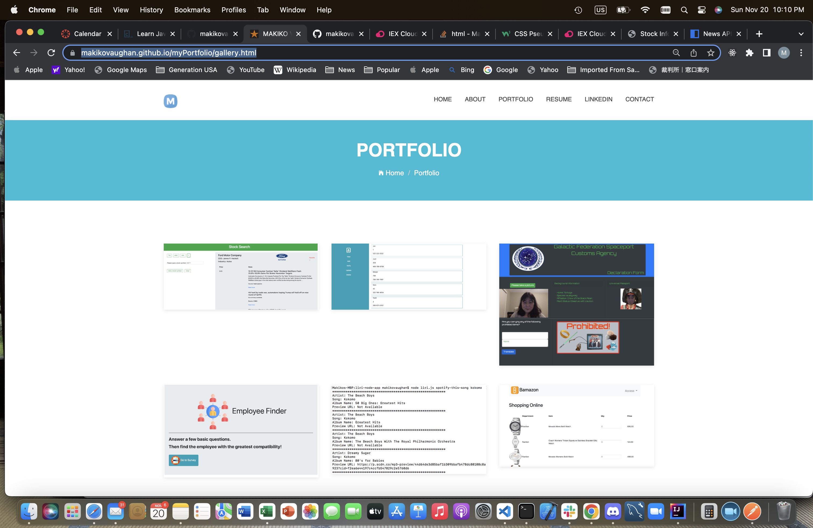

# Stock-Search

## Description

This program allows to create a stock symbol button and provide its stock inforamtion
by clicking its stock symbol button.

## API

Using iexTrading API.
([iexTrading API](https://iexcloud.io/docs/api/#query-parameters))
###note: API key works temporarily for a month.

## Structure of files

- index.html: Framework HTML
- app.js: Javascript file
- ./assets/css/style.css: CSS file
- ./assets/css/images: Images files for readme.

## **_How to use_**

1. Go to this URL to access this program ([Stock-Search](https://makikovaughan.github.io/Stock-Search/))

2. Type a stock symbol name and click on "Add a stock symbol" button.

3. If the stock symbol is blank or incorrect, then an alert will be popped up.

4. If you type an existing stock symbol and click on Add a stock symbol, then a new stock symbol button will be created at the top corner left window.(For this example, MSFT)

5. Click on the stock button for the information you want, and then it will diplay the information.

6. If you want to keep the stock button you created after resetting by clear button, then check on the favorite checkmark button.

7. After clicking Clear button, MSFT
   button stays on the screen.

### Note

You can access this site from:
https://makikovaughan.github.io/myPortfolio/index.html

or

https://makikovaughan.github.io/myPortfolio/gallery.html

## Author

Makiko Vaughan
