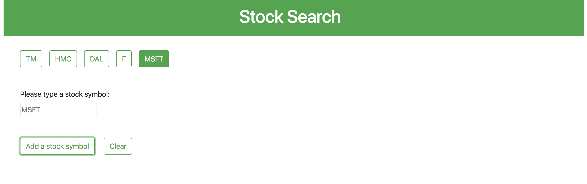

# Stock-Search

Descrription
------------
This program allows to create a stock symbol button and provide its stock inforamtion
by clicking its stock symbol button.

How to use
-----------
1. Go to this URL to access this program ([Stock-Search](https://makikovaughan.github.io/Stock-Search/))

2. Type a stock symbol name and click on "Add a stock symbol" button.

3. If the stock symbol does not exist, it will receive an alert.

4. If you type an existing stock symbol and click on Add a stock symbol, then a new stock symbol button will be created at the top corner left window.(For this example, MSFT)

